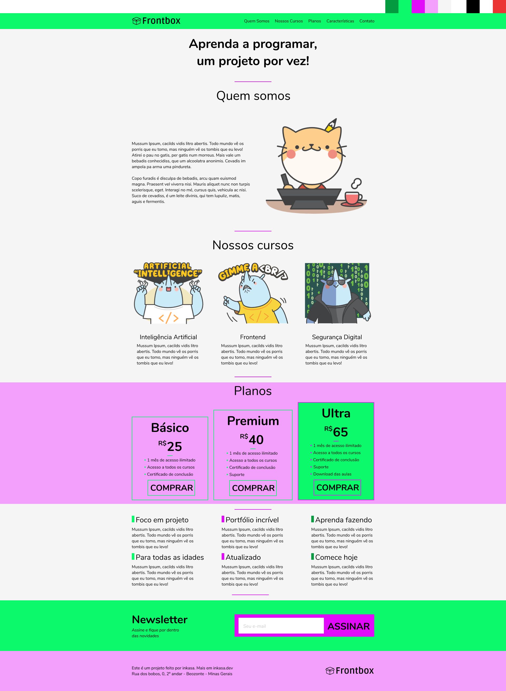

<h1 align="center"> FM Front-Box </h1>

Uma Loja virtual.  

 

  

## 🚀 Tecnologias

Esse projeto foi desenvolvido com as seguintes tecnologias:

-   HTML e CSS.

## 📚 Conceitos aprendidos no projeto

-   Flexbox
-   Box Sizing
-   BEM
-   Trabalhar com variáveis CSS
-   Media Queries

